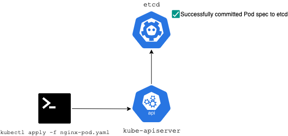
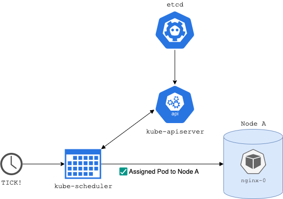
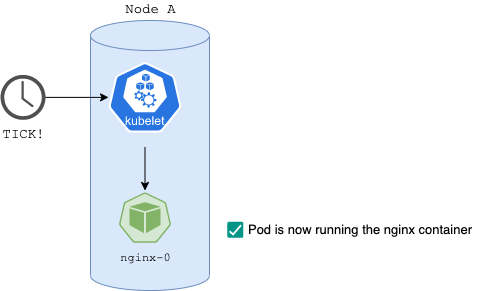

# Master

## Control Plane

- Highly Available

## kube-apiserver

- Raw REST API provided via the control plane to manage resources
    - API takes care of authentication, RBAC validation etc.
- Abstraction is provided via `kubectl` so that you do not have to craft REST calls directly via `curl` or a REST client
- Helpful for troubleshooting cluster issues
- Designed to scale horizontally (load balanced traffic across a large node farm)

## etcd

- Key-value pair database that tracks everything in k8s (HA)
- etcd can only be communicated with via the kube-apiserver
- Encrypted / secure storage
- Large clusters may need distributed etcd for fault tolerance

## kube-scheduler

- Observes newly created Pods with no assigned Nodes
- Manages the following Pod ↔ Node relationships
    - Node affinity
    - Individual / collective resource requirements
    - Hardware / software constraints

Example of an interaction deploying a simple Pod Spec:

## Kube Controller Manager

A service running inside the Kubernetes Master

- Manages namespace creation and lifecycles
- Event GC
- Terminated Pod GC
- Cascading Deletion GC
- Node GC

**Node Controller**

- Responsible for detecting and handling Node failures

**Job Controller**

- Manages “Job” objects to handle one-time tasks

**Endpoint Controller**

- Manages “endpoint” object data

**Service Account & Token Controllers**

- Manages default accounts and API access tokens
  - Used when creating a new namespace

## Cloud Controller Manager

---

# Node

## kubelet

- Agent that runs in k8s nodes to report information back to the Control Plane
- Ensures that containers are running in pods
  - Takes a Pod spec and ensures that the described containers are running and healthy
  - Starts Pods using the Container Runtime
  - Monitors lifecycle and checks for readiness

## kube-proxy

- Network proxy that runs on each Node in the cluster
- Manages network rules on nodes
  - Allows communication between Pods and Nodes via sessions
- If packet filtering is set at the OS (Node) level, kube-proxy will use these settings
- Monitors changes in kube-apiserver and makes necessary changes (ie: Pods that move to a different Node etc. by updating the network with IPTABLES)

## Container Runtimes

- Docker is the primary container runtime supported by K8s, also can run:
  - containerd
  - CRI-O
  - rktlet
  - Kubernetes CRI
    - CRI = “Container Runtime Interface”
    - Used by Kubernetes 1.7+
    - A generic layer that interacts with other 3rd party container runtimes
- Not a Kubernetes managed system
- Leverages existing Open Source container runtimes

## cAdvisor

- Google solution that monitors container health within pods
- Evaluates container performance
